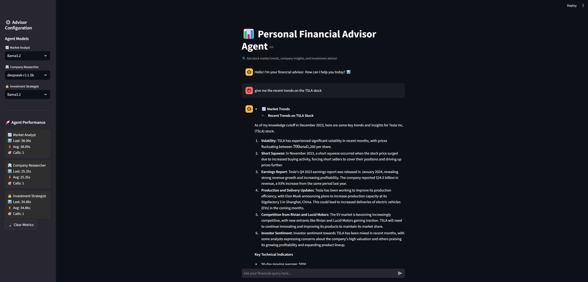

# 📊 Personal Financial Advisor Agent

A Streamlit-powered AI application that provides stock market analysis, company insights, and investment recommendations using multiple AI agents.

  

## 🌟 Features

- **Multi-Agent AI System**  
  - 📈 **Market Analyst**: Identifies market trends
  - 🏢 **Company Researcher**: Analyzes financials and risks
  - 💰 **Investment Strategist**: Provides portfolio recommendations

- **Real-Time Stock Data**  
  - Price history visualization with moving averages
  - Key metrics (52-week high/low, market cap, earnings dates)

- **Interactive Chat Interface**  
  - Natural language queries
  - Context-aware responses

- **Performance Monitoring**  
  - Response time tracking
  - Agent usage statistics

- **Customizable Models**  
  - Switch between LLama3 and DeepSeek models per agent

## 🚀 Installation

1. **Prerequisites**:
   - Python 3.8+
   - [Ollama](https://ollama.ai/) running locally
   ```bash
   # Download required models
   ollama pull llama3.2
   ollama pull deepseek-r1:1.5b

## Setting up Conda env & running the streamlit ui

Conda env setup
```
conda create -p venv python==3.12
```

install the required libraries/dependencies
```
pip install -r requirements.txt
```

to start the streamlit page: 
```
streamlit run app.py
```